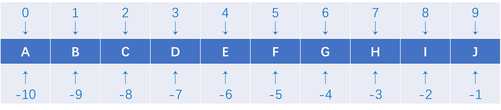
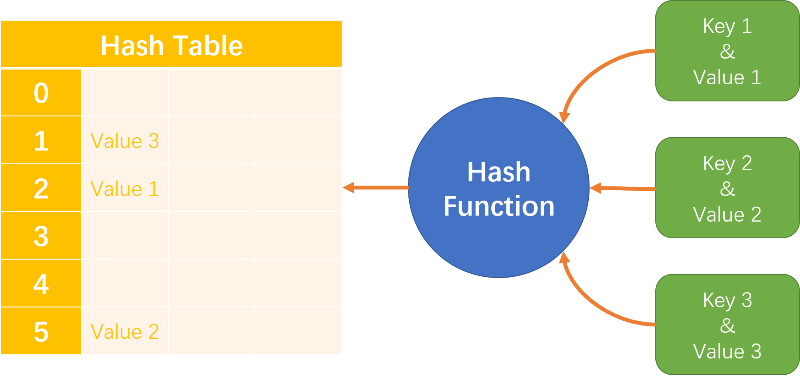

# Python Data Structures


###### _Table of Contents_

- Linear Structures
	1. [List](#1-list)
	2. [Tuple](#2-tuple)
- Non-linear Structures
	1. [Dictionary](#3-dictionary)
	2. [Set](#4-set)


## Linear Data Structures


### 1. List
[↑](#table-of-contents)

**Declaration**

`List = [value1, value2, value3]`

**Concept**

> Lists are mutable sequences of object references accessed by position. (Lutz, 2014)

**Features**

* The elements in a list have certain positions in the list, and can be sliced
* A list can contain any object in Python
* Every element is mutable
* A list is dynamic

**Common Manipulations**

``` python
# declaration
EmptyList = []
List = list("spam")
List = ['A', 'B', 'C']

# insertion
List.append('G')
List.insert(3, 'D')
List[4:4] = 'E'

# access
List[-1] = 'F'
val = List[0]
pos = List.index('B')

# deletion
val = List.pop()
val = List.pop(3)
List.remove('E')
del List[0:3]

# extention
List.extend(['B', 'C'])
List[len(List):] = ['D', 'E', 'F']
List[:0] = ['A']

# order
List.reverse()
List.sort(key = None, reverse = False)

# membership
val in List # elements iteration
freq = List.count('A')
size = len(List)

# clearance
List.clear()
```

-------------------------------------------------------

### 2. Tuple
[↑](#table-of-contents)

**Declaration**

`Tuple = (value1, value2, value3)`

**Concept**

> Tuples are immutable sequences of object references accessed by position. Function as fixed lists. (Lutz, 2014)

**Features**

* The elements are ordered, and can be sliced
* An element in a tuple can be any object in Python
* Every single element is immutable
* A tuple is static

**Common Manipulations**

```python
# declaration
EmptyTuple = ()
Tuple = tuple("spam")
Tuple = ([1, 0, 0], [0, 1, 0], [0, 0, 1])

# access
val = Tuple[0]
pos = Tuple.index([0, 1, 0])

# membership
val in Tuple # elements iteration
freq = Tuple.count([0, 1, 0])
size = len(Tuple)
```

-------------------------------------------------------

## Non-linear Data Structures


### 3. Dictionary
[↑](#table-of-contents)

**Declaration**

`Dict = {key1:value1, key2:value2, key3:value3}`

**Concept**

> Dictionaries are mutable mappings of object references accessed by key. They are unordered tables that maps keys to values, implemented internally as dynamically expandable hash tables. (Lutz, 2014)

**Features**

* Data in a dictionary must be in the form of pairs of a key and a value, and the keys acts as indexes of the values
* Logically, a key must be unique within a dictionary, but two values can be identical
* The keys cannot be mutable objects, but the values can take any object in Python
* The keys are not changeable, but the values are mutable
* A dictionary is dynamic

**Common Manipulations**

```python
# declaration
EmptyDict = {}
Dict = dict(zip([1, 2, 3, 4], "spam"))
Dict = dict([(1, 's'), (2, 'p'), (3, 'a'), (4, 'm')])
Dict = {"Amy":[1, 2], "Bob":[2, 3], "Cindy":[3, 4]}

# insertion
Dict["David"] = [4, 5]

# access
Dict["David"] = "Hello"
val = Dict["Amy"]
val = Dict.get("Davis")

# deletion
Dict.popitem()
Dict.pop("Bob")
del Dict["Cindy"]

# extention
Dict.update({"Bob":[2, 3], "Cindy":[3, 4]})

# membership
key in Dict # keys iteration
Dict.keys()
Dict.values()
Dict.items()
size = len(Dict)

# clearance
Dict.clear()
```

-------------------------------------------------------

### 4. Set
[↑](#table-of-contents)

**Declaration**

`Set = {key1, key2, key3}`

**Concept**

> Sets are mutable and unordered collections of unique and immutable objects. Function as a key-only (value-less) dictionaries. (Lutz, 2014)

**Features**

* The elements are not indexed
* Two elements cannot be identical in a set
* The elements cannot be mutable objects
* A single element is not mutable
* A set is dynamic

**Common Manipulations**

```python
# declaration
EmptySet = set()
Set = set("spam")
Set = {100, 200, 300}

# insertion
Set.add(400)

# deletion
Set.remove(400)
Set.discard(500)
key = Set.pop()

# extention
Set.update({200})
Set |= EmptySet

# membership
key in Set # elements iteration
size = len(Set)

# mathematical operations
(Set - EmptySet) == Set.difference(EmptySet)
(Set ^ EmptySet) == Set.symmetric_difference(EmptySet)
(Set | EmptySet) == Set.union(EmptySet)
(Set & EmptySet) == Set.intersection(EmptySet)
(Set <= EmptySet) == Set.issubset(EmptySet)
(Set >= EmptySet) == Set.issuperset(EmptySet)

# clearance
Set.clear()
```

## *References*
Lutz, M. (2014). Specific Built-in Types. In _Python Pocket Reference: Python in Your Pocket_ (5th ed.) (pp. 21-66). Sebastopol, CA: O'Reilly Media.
